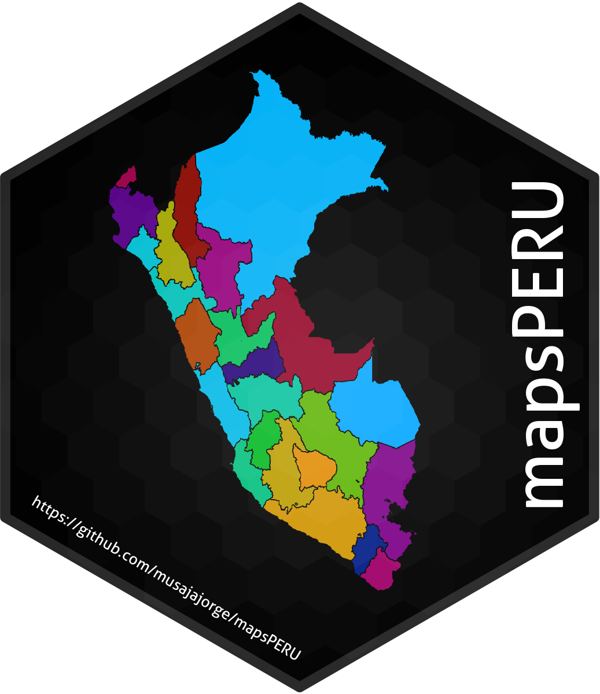
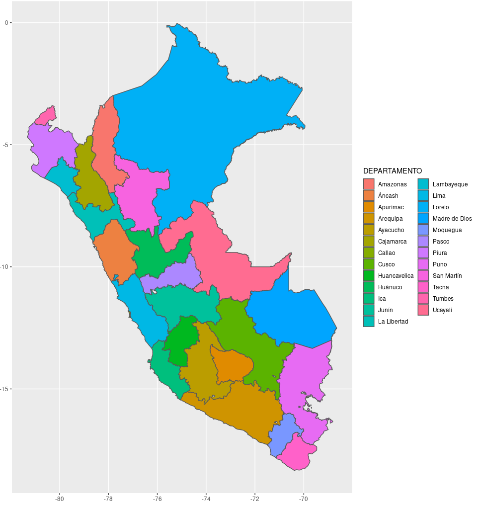
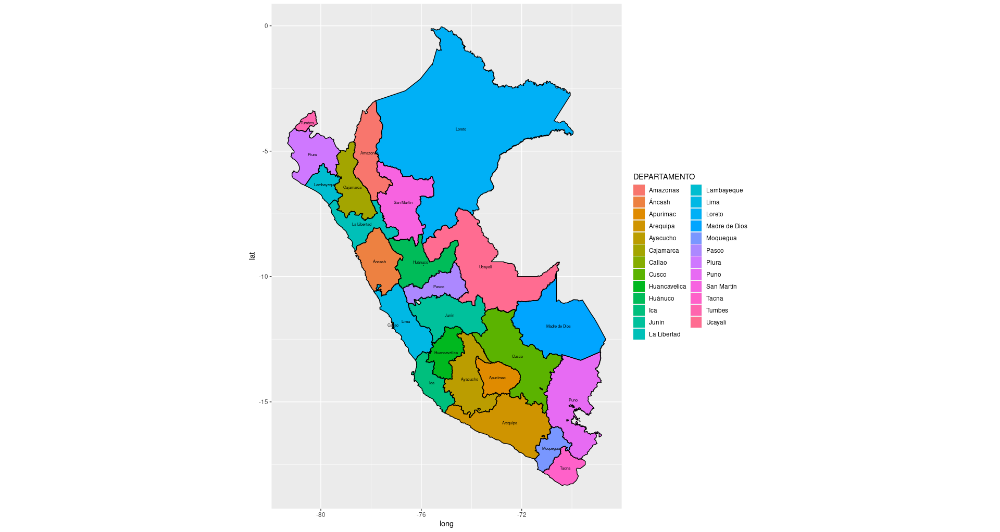

# mapsPERU 

<!-- badges: start -->


[](https://github.com/ellerbrock/open-source-badges/)
[](https://www.repostatus.org/#active)
[](https://svgshare.com/i/Zhy.svg)


[](https://CRAN.R-project.org/package=mapsPERU)

<!-- badges: end -->

[**mapsPERU**](https://github.com/musajajorge/mapsPERU/) is a package that provides datasets with information about the departmental and regional boundaries of Peru.

## Installation

Install **mapsPERU** with

``` r
library(remotes)
install_github("musajajorge/mapsPERU")
```

## Documentation

The datasets included in this package are:
- boundaries_DEP: Departmental boundaries of Peru
- boundaries_REG: Regional boundaries of Peru
- centroids_DEP: Departmental centroids of Peru
- centroids_REG: Regional centroids of Peru

### Data dictionary

- boundaries_DEP

| Column | Type | Description |
| --------------- | --------------- | --------------- |
| long | dbl | Longitude of the departmental boundary |
| lat | dbl | Latitude of the departmental boundary |
| COD_DEPARTAMENTO | chr | Department Code |
| DEPARTAMENTO | chr | Department name |
| group | fct | Group identifier on map |

- boundaries_REG

| Column | Type | Description |
| --------------- | --------------- | --------------- |
| long | dbl | Longitude of the regional boundary |
| lat | dbl | Latitude of the regional boundary |
| COD_REGION | chr | Region Code |
| REGION | chr | Region name |
| group | fct | Group identifier on map |

- centroids_DEP

| Column | Type | Description |
| --------------- | --------------- | --------------- |
| long | dbl | Longitude of the departmental centroid |
| lat | dbl | Latitude of the departmental centroid |
| COD_DEPARTAMENTO | chr | Department Code |
| DEPARTAMENTO | chr | Department name |

- centroids_REG

| Column | Type | Description |
| --------------- | --------------- | --------------- |
| long | dbl | Longitude of the regional centroid |
| lat | dbl | Latitude of the regional centroid |
| COD_REGION | chr | Region Code |
| REGION | chr | Region name |

Note: Officially there is no codification for regions, only for departments. Therefore, the codes 150100 for Metropolitan Lima and 159900 for Lima Provinces should be taken as a reference.

## Usage

**mapsPERU** will provide you with departmental or regional boundaries, but you must use ggplot2 to plot the maps.

### Use departmental boundaries of Peru in a map with ggplot2

``` r
library(mapsPERU)
boundaries <- boundaries_DEP

library(ggplot2)
ggplot(data=boundaries)+
aes(x=long, y=lat, group=group)+
geom_polygon(aes(fill=DEPARTAMENTO))+
coord_equal()+
geom_path(color="black")
```

In this example we are using the name of the departments as a categorical variable in the graph. You can combine the **mapsPERU** data sets with other categorical or numeric variables that you want to plot.



### Use departmental boundaries of Peru and centroids in a map with ggplot2

Note that **mapsPERU** also provides geographic information of the centroids, so you can include the names of the departments as labels.

``` r
library(mapsPERU)
boundaries <- boundaries_DEP
centroids <- centroids_DEP

library(ggplot2)
ggplot(data=boundaries)+
aes(x=long, y=lat, group=group)+
geom_polygon(aes(fill=DEPARTAMENTO))+
coord_equal()+
geom_path(color="black")+
geom_text(data=centroids, aes(long, lat, group=NULL, label=DEPARTAMENTO), size=2)
```




