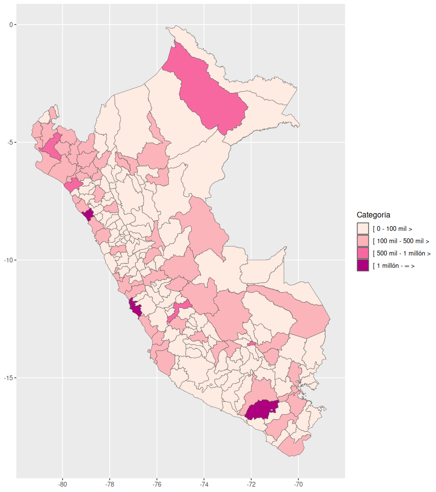
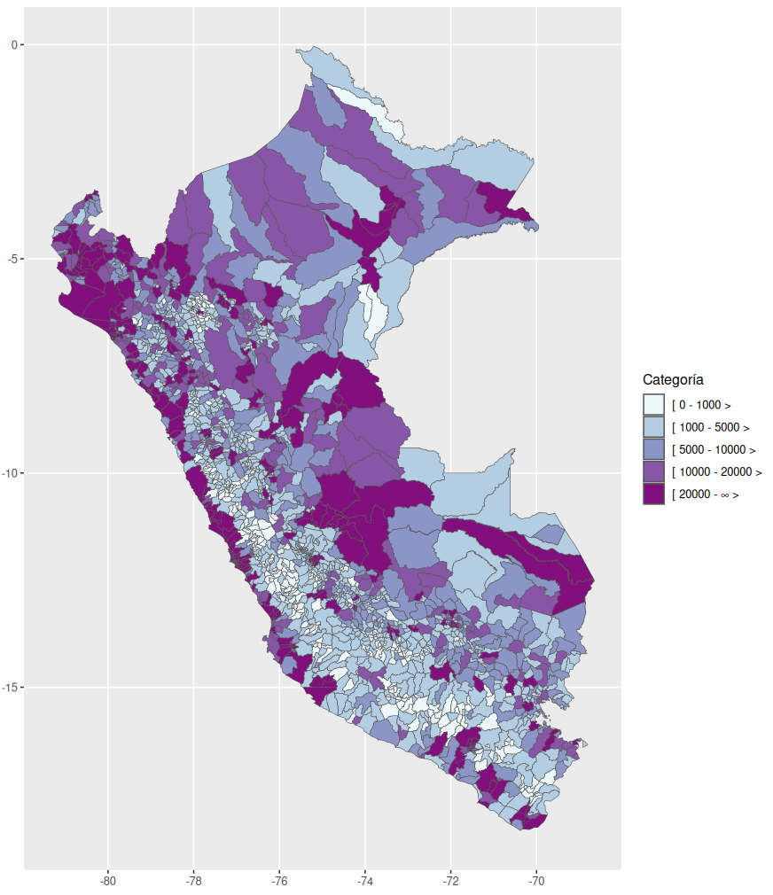

# mapsPERU 

<!-- badges: start -->


[](https://github.com/ellerbrock/open-source-badges/)
[](https://www.repostatus.org/#active)
[](https://svgshare.com/i/Zhy.svg)

[](https://CRAN.R-project.org/package=mapsPERU)

[](https://CRAN.R-project.org/package=mapsPERU)
[](https://doi.org/10.5281/zenodo.5640186)

<!-- badges: end -->

[**mapsPERU**](https://github.com/musajajorge/mapsPERU/) is a package that provides datasets with information of the centroids and geographical limits of the regions, departments, provinces and districts of Peru.

## Installation

Install **mapsPERU** version 0.1.3 from [**CRAN**](https://CRAN.R-project.org/package=mapsPERU):

``` r
install.packages("mapsPERU")
```

<H6>
Note: Version 0.1.2 does not include geographic information at the district level.
</H6>

or install **mapsPERU** version 1.0.0 with

``` r
library(remotes)
install_github("musajajorge/mapsPERU")
```

## Documentation

The datasets included in this package are:
- map_DEP: Geographic information of the departments of Peru
- map_PROV: Geographic information of the provinces of Peru
- map_DIST: Geographic information of the districts of Peru
- map_REG: Geographic information of the regions of Peru

### Data dictionary (version 1.0.0)

- map_DEP

| Column | Type | Description |
| --------------- | --------------- | --------------- |
| COD_DEPARTAMENTO | chr | Department Code |
| DEPARTAMENTO | chr | Department name |
| coords_x | dbl | Longitude of the centroid of the department |
| coords_y | dbl | Latitude of the centroid of the department |
| geometry | MULTIPOLYGON | MULTIPOLYGON Geometric object |

- map_PROV

| Column | Type | Description |
| --------------- | --------------- | --------------- |
| COD_DEPARTAMENTO | chr | Province Code |
| DEPARTAMENTO | chr | Department name |
| PROVINCIA | chr | Province name |
| coords_x | dbl | Longitude of the centroid of the province |
| coords_y | dbl | Latitude of the centroid of the province |
| geometry | MULTIPOLYGON | MULTIPOLYGON Geometric object |

- map_DIST

| Column | Type | Description |
| --------------- | --------------- | --------------- |
| COD_DISTRITO | chr | District Code |
| DEPARTAMENTO | chr | Department name |
| PROVINCIA | chr | Province name |
| DISTRITO | chr | District name |
| coords_x | dbl | Longitude of the centroid of the district |
| coords_y | dbl | Latitude of the centroid of the district |
| geometry | MULTIPOLYGON | MULTIPOLYGON Geometric object |

- map_REG

| Column | Type | Description |
| --------------- | --------------- | --------------- |
| COD_REGION | chr | Region Code |
| REGION | chr | Region name |
| coords_x | dbl | Longitude of the centroid of the region |
| coords_y | dbl | Latitude of the centroid of the region |
| geometry | MULTIPOLYGON | MULTIPOLYGON Geometric object |

Note: Officially there is no codification for regions, only for departments. Therefore, the codes 150100 for Metropolitan Lima and 159900 for Lima Provinces should be taken as a reference.

## Usage

You do not need to install additional packages to use **mapsPERU** datasets; however, if you want to see the structure of each dataset with *str()* or *dplyr::glimpse()* it is advisable to run *library(sf)* beforehand.


### Use departmental dataset in a map with ggplot2

``` r
library(mapsPERU)
df <- map_DEP

library(ggplot2)
ggplot(df, aes(geometry=geometry)) +
  geom_sf(aes(fill=DEPARTAMENTO))
```

In this example we are using the name of the departments as a categorical variable in the graph. You can combine the **mapsPERU** data sets with other categorical or numeric variables that you want to plot.


### Use the departmental dataset with centroids in a map with ggplot2

Note that **mapsPERU** also provides geographic information of the centroids, so you can include the names of the departments as labels.

``` r
library(mapsPERU)
df <- map_DEP

library(ggplot2)
library(ggrepel)
ggplot(df, aes(geometry=geometry)) +
  geom_sf(aes(fill=DEPARTAMENTO)) +
  geom_text_repel(mapping = aes(coords_x, coords_y, label=DEPARTAMENTO), 
                  size=3, min.segment.length=0)+
  labs(x="", y="")
```


### Use regional dataset in a map with ggplot2

The centroids dataset not only provides the longitudes and latitudes of each region but also includes the geometry field, which is a multipolygon that will allow us to plot numerical variables on our map.

In this example, we are going to plot the average cost per student (ACPS) in university higher education in the year 2020.

``` r
library(mapsPERU)
df <- map_REG

REGION <- c('Amazonas','Áncash','Apurímac','Arequipa','Ayacucho','Cajamarca','Callao',
            'Cusco','Huancavelica','Huánuco','Ica','Junín','La Libertad','Lambayeque',
            'Lima Metropolitana','Lima Provincias','Loreto','Madre de Dios','Moquegua',
            'Pasco','Piura','Puno','San Martín','Tacna','Tumbes','Ucayali')
ACPS <- c(12364,7001,8615,10302,5015,8632,7507,7909,6843,8412,6950,7182,8363,5941,10595, 
          6742,8250,6888,31287,7630,12647,7282,10512,8017,11454,6998)
ACPS <- data.frame(cbind(REGION,ACPS)) 
ACPS$ACPS <- as.numeric(ACPS$ACPS)

library(dplyr)
library(sf)
df <- left_join(df, ACPS, by="REGION")

library(ggplot2)
ggplot(df, aes(geometry=geometry)) +
  geom_sf(aes(fill=ACPS)) +
  scale_fill_gradient (low="mediumblue", high="red3")
```


### Use the regional dataset with centroids in a map with ggplot2

In this example we will show how the use of regional boundaries and centroids datasets facilitates the filtering of specific regions to be displayed on the map.

``` r
library(mapsPERU)
df <- map_REG

df <- dplyr::filter(df, REGION=="Lima Metropolitana" |
                      REGION=="Lima Provincias" | REGION=="Callao")

library(ggplot2)
library(ggrepel)
ggplot(df, aes(geometry=geometry)) +
  geom_sf(aes(fill=REGION)) +
  geom_text_repel(mapping = aes(coords_x, coords_y, label=REGION), 
                  size=3, min.segment.length=0)+
  labs(x="", y="")
```


### Use the provincial dataset in a map with ggplot2

``` r
library(mapsPERU)
df <- map_PROV

library(readxl)
url <- "https://zenodo.org/record/5646444/files/POBLACION_INEI_2021.xlsx?download=1"
destfile <- "POBLACION_INEI_2021.xlsx"
curl::curl_download(url, destfile)
pob <- read_excel(destfile)

library(dplyr)
pob_prov <- pob %>%
  group_by(COD_PROVINCIA) %>%
  summarise(Población = sum(Cantidad))

library(dplyr)
library(sf)
df <- left_join(df, pob_prov, by="COD_PROVINCIA")

df$Categoría <- cut(df$Población, right=F, breaks=c(0,100000,500000,1000000,Inf),
                    labels=c("Menos a 100 mil personas",
                             "Menos de 500 mil personas",
                             "Más de 500 mil personas",
                             "Más de 1 millón de personas"))

colores <- c('#feebe2','#fbb4b9','#f768a1','#ae017e')

library(ggplot2)
ggplot(df, aes(geometry=geometry)) +
  scale_fill_manual(values=colores)+
  geom_sf(aes(fill=Categoría)) 
```




### Use the district dataset in a map with ggplot2

``` r
library(mapsPERU)
df <- map_DIST

library(readxl)
url <- "https://zenodo.org/record/5646444/files/POBLACION_INEI_2021.xlsx?download=1"
destfile <- "POBLACION_INEI_2021.xlsx"
curl::curl_download(url, destfile)
pob <- read_excel(destfile)

library(dplyr)
pob_dist <- pob %>%
  group_by(COD_DISTRITO) %>%
  summarise(Cantidad = sum(Cantidad))

library(dplyr)
library(sf)
df <- left_join(df, pob_dist, by="COD_DISTRITO")

df$Pob_Group <- ifelse(df$Cantidad<1000, "Menos de 1,000",
                       ifelse(df$Cantidad<5000, "Menos de 5,000",
                              ifelse(df$Cantidad<10000, "Menos de 10,000",
                                     ifelse(df$Cantidad<20000, "Menos de 20,000",
                                            "Más de 20,000"))))

df$Pob_Group <- factor(df$Pob_Group, levels=c("Menos de 1,000","Menos de 5,000",
                                              "Menos de 10,000","Menos de 20,000",
                                              "Más de 20,000"))

colores <- c('#edf8fb','#b3cde3','#8c96c6','#8856a7','#810f7c')

library(ggplot2)
ggplot(df, aes(geometry=geometry)) +
  scale_fill_manual(values=colores)+
  geom_sf(aes(fill=Pob_Group))
```



------------

<p align="center">
    
</p>
