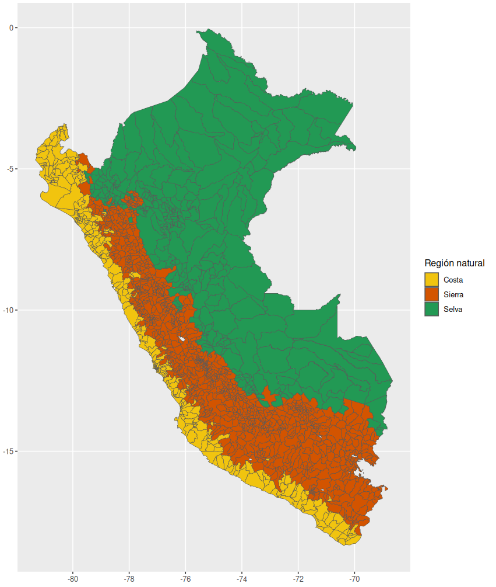

# mapsPERU 

<!-- badges: start -->


[](https://github.com/ellerbrock/open-source-badges/)
[](https://www.repostatus.org/#active)

[](https://CRAN.R-project.org/package=mapsPERU)
[](https://CRAN.R-project.org/package=mapsPERU)
[](https://doi.org/10.5281/zenodo.17408542)


<!-- badges: end -->

[**mapsPERU**](https://github.com/musajajorge/mapsPERU/) is a package that provides datasets with information of the centroids and geographical limits of the regions, departments, provinces and districts of Peru.

## Installation :arrow_double_down:

Install **mapsPERU** from [**CRAN**](https://CRAN.R-project.org/package=mapsPERU):

``` r
install.packages("mapsPERU")
```

or install **mapsPERU** with

``` r
library(remotes)
install_github("musajajorge/mapsPERU")
```

## Documentation :books:

The datasets included in this package are:
- map_REG: Geographic information of the regions of Peru
- map_DEP: Geographic information of the departments of Peru
- map_PROV: Geographic information of the provinces of Peru
- map_DIST: Geographic information of the districts of Peru

### Data dictionary   

- map_REG

| Column | Type | Description |
| --------------- | --------------- | --------------- |
| COD_REGION | chr | Region code |
| REGION | chr | Region name |
| POBLACION_2025 | dbl | Projected population of the region in 2025 |
| coords_x | dbl | Longitude of the centroid of the region |
| coords_y | dbl | Latitude of the centroid of the region |
| geometry | MULTIPOLYGON | MULTIPOLYGON Geometric object |

Note: Officially there is no codification for regions, only for departments. Therefore, the codes 150100 for Metropolitan Lima and 159900 for Lima Provinces should be taken as a reference.

- map_DEP

| Column | Type | Description |
| --------------- | --------------- | --------------- |
| COD_DEPARTAMENTO | chr | Department code |
| DEPARTAMENTO | chr | Department name |
| POBLACION_2025 | dbl | Projected population of the department in 2025 |
| coords_x | dbl | Longitude of the centroid of the department |
| coords_y | dbl | Latitude of the centroid of the department |
| geometry | MULTIPOLYGON | MULTIPOLYGON Geometric object |

- map_PROV

| Column | Type | Description |
| --------------- | --------------- | --------------- |
| COD_REGION | chr | Region code |
| COD_DEPARTAMENTO | chr | Department code |
| COD_PROVINCIA | chr | Province code |
| REGION | chr | Region name |
| DEPARTAMENTO | chr | Department name |
| PROVINCIA | chr | Province name |
| POBLACION_2025 | dbl | Projected population of the province in 2025 |
| coords_x | dbl | Longitude of the centroid of the province |
| coords_y | dbl | Latitude of the centroid of the province |
| geometry | MULTIPOLYGON | MULTIPOLYGON Geometric object |

- map_DIST

| Column | Type | Description |
| --------------- | --------------- | --------------- |
| COD_REGION | chr | Region code |
| COD_DEPARTAMENTO | chr | Department code |
| COD_PROVINCIA | chr | Province code |
| COD_DISTRITO | chr | District code |
| REGION | chr | Region name |
| DEPARTAMENTO | chr | Department name |
| PROVINCIA | chr | Province name |
| DISTRITO | chr | District name |
| REGION_NATURAL | chr | Natural region |
| POBLACION_2025 | dbl | Projected population of the district in 2025 |
| coords_x | dbl | Longitude of the centroid of the district |
| coords_y | dbl | Latitude of the centroid of the district |
| geometry | MULTIPOLYGON | MULTIPOLYGON Geometric object |

## Usage :muscle:

You do not need to install additional packages to use **mapsPERU** datasets; however, if you want to see the structure of each dataset with *str()* or *dplyr::glimpse()* it is advisable to run *library(sf)* beforehand.


### Use departmental dataset in a map with ggplot2

``` r
library(mapsPERU)
df <- map_DEP

library(ggplot2)
library(sf)
ggplot(df, aes(geometry=geometry)) +
  geom_sf(aes(fill=DEPARTAMENTO))
```

In this example we are using the name of the departments as a categorical variable in the graph. You can combine the **mapsPERU** data sets with other categorical or numeric variables that you want to plot.


### Use the departmental dataset with centroids in a map with ggplot2

Note that **mapsPERU** also provides geographic information of the centroids, so you can include the names of the departments as labels.

``` r
library(mapsPERU)
df <- map_DEP

library(ggplot2)
library(sf)
ggplot(df, aes(geometry=geometry)) +
  geom_sf(aes(fill=DEPARTAMENTO)) +
  geom_text(data=df, aes(coords_x, coords_y, group=NULL, label=DEPARTAMENTO), size=2.5) +
  labs(x="", y="")
```


### Use regional dataset in a map with ggplot2

The centroids dataset not only provides the longitudes and latitudes of each region but also includes the geometry field, which is a multipolygon that will allow us to plot numerical variables on our map.

In this example, we will graph the projected population by region for the year 2025.

``` r
library(mapsPERU)
df <- map_REG

library(ggplot2)
library(sf)
ggplot(df, aes(geometry=geometry)) +
  geom_sf(aes(fill=POBLACION_2025/1000000)) +
  scale_fill_gradient (low="#abd9e9", high="#c51b7d", name="Población 2025 (millones)")
```


### Use the regional dataset with centroids in a map with ggplot2

In this example we will show how the use of regional boundaries and centroids datasets facilitates the filtering of specific regions to be displayed on the map.

``` r
library(mapsPERU)
df <- map_REG

df <- dplyr::filter(df, REGION=="Lima Metropolitana" |
                      REGION=="Lima Provincias" | REGION=="Callao")

library(ggplot2)
library(sf)
ggplot(df, aes(geometry=geometry)) +
  geom_sf(aes(fill=REGION)) +
  geom_text(aes(coords_x, coords_y, group=NULL, label=REGION), size=3) +
  labs(x="", y="")
```


### Use the provincial dataset in a map with ggplot2

``` r
library(mapsPERU)
df <- map_PROV

df$Categoría <- cut(df$POBLACION_2025, right=F, breaks=c(0,100000,500000,1000000,Inf),
                    labels=c("[ 0 - 100 mil >",
                             "[ 100 mil - 500 mil >",
                             "[ 500 mil - 1 millón >",
                             "[ 1 millón - ∞ >"))

colores <- c('#feebe2','#fbb4b9','#f768a1','#ae017e')

library(sf)
library(ggplot2)
ggplot(df, aes(geometry=geometry)) +
  scale_fill_manual(values=colores)+
  geom_sf(aes(fill=Categoría)) 
```


### Use the district dataset in a map with ggplot2

``` r
library(mapsPERU)
df <- map_DIST

df$Categoría <- cut(df$POBLACION_2025, right=F, breaks=c(0,1000,5000,10000,20000,Inf),
                    labels=c("[ 0 - 1000 >",
                             "[ 1000 - 5000 >",
                             "[ 5000 - 10000 >",
                             "[ 10000 - 20000 >",
                             "[ 20000 - ∞ >"))

colores <- c('#edf8fb','#b3cde3','#8c96c6','#8856a7','#810f7c')

library(sf)
library(ggplot2)
ggplot(df, aes(geometry=geometry)) +
  scale_fill_manual(values=colores)+
  geom_sf(aes(fill=Categoría))
```


### Use the natural region information on a district level map.

``` r
library(mapsPERU)
df <- map_DIST

df$REGION_NATURAL <- ordered(df$REGION_NATURAL, levels=c("Costa","Sierra","Selva"))

colores <- c('#F1C40F','#D35400','#229954')

library(sf)
library(ggplot2)
ggplot(df, aes(geometry=geometry)) +
  scale_fill_manual(values=colores) +
  geom_sf(aes(fill=REGION_NATURAL)) +
  labs(fill='Región natural')
```



------------

<p align="center">
    
</p>
