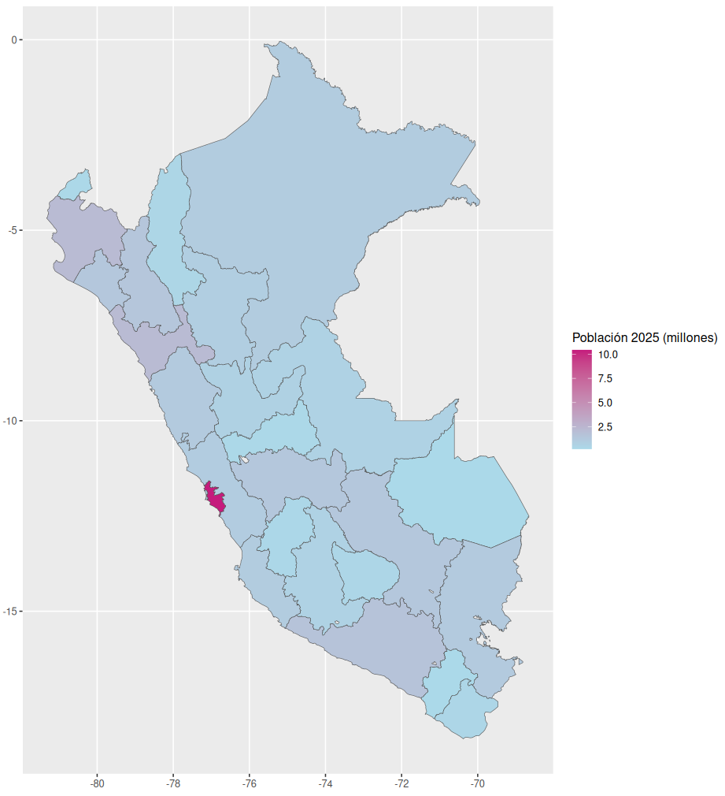
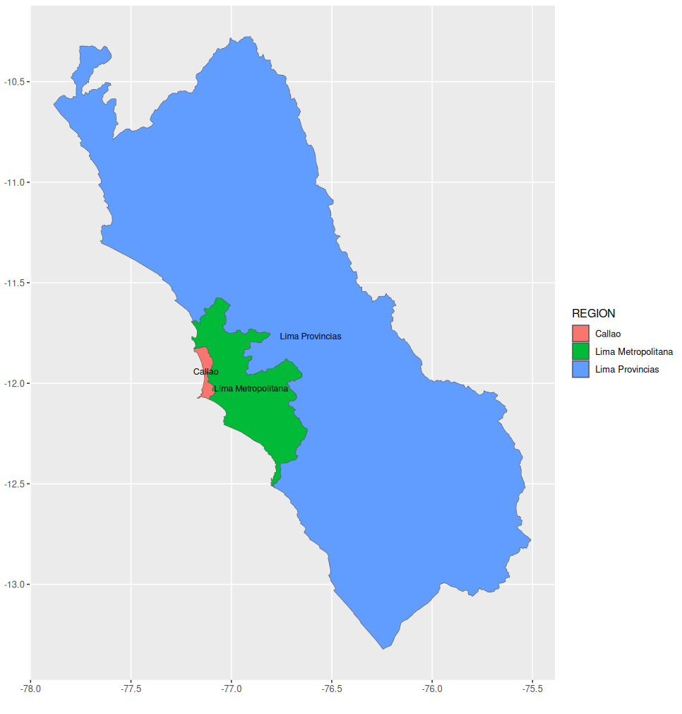

# mapsPERU 

<!-- badges: start -->


[](https://github.com/ellerbrock/open-source-badges/)
[](https://www.repostatus.org/#active)
[](https://svgshare.com/i/Zhy.svg)

[](https://CRAN.R-project.org/package=mapsPERU)

[](https://CRAN.R-project.org/package=mapsPERU)

<!-- badges: end -->

[**mapsPERU**](https://github.com/musajajorge/mapsPERU/) is a package that provides datasets with information about the departmental and regional boundaries of Peru.

## Installation

Install **mapsPERU** version 0.1.2 from [**CRAN**](https://CRAN.R-project.org/package=mapsPERU):

``` r
install.packages("mapsPERU")
```

or install **mapsPERU** version 0.1.3 with

``` r
library(remotes)
install_github("musajajorge/mapsPERU")
```

## Documentation

The datasets included in this package are:
- boundaries_DEP: Departmental boundaries of Peru
- boundaries_REG: Regional boundaries of Peru
- centroids_DEP: Departmental centroids of Peru
- centroids_REG: Regional centroids of Peru

### Data dictionary

- boundaries_DEP

| Column | Type | Description |
| --------------- | --------------- | --------------- |
| long | dbl | Longitude of the departmental boundary |
| lat | dbl | Latitude of the departmental boundary |
| COD_DEPARTAMENTO | chr | Department Code |
| DEPARTAMENTO | chr | Department name |
| group | dbl | Group identifier on map |

- boundaries_REG

| Column | Type | Description |
| --------------- | --------------- | --------------- |
| long | dbl | Longitude of the regional boundary |
| lat | dbl | Latitude of the regional boundary |
| COD_REGION | chr | Region Code |
| REGION | chr | Region name |
| group | dbl | Group identifier on map |

- centroids_DEP

| Column | Type | Description |
| --------------- | --------------- | --------------- |
| long | dbl | Longitude of the departmental centroid |
| lat | dbl | Latitude of the departmental centroid |
| COD_DEPARTAMENTO | chr | Department Code |
| DEPARTAMENTO | chr | Department name |
| geometry | GEOMETRY | Geometric object |

- centroids_REG

| Column | Type | Description |
| --------------- | --------------- | --------------- |
| long | dbl | Longitude of the regional centroid |
| lat | dbl | Latitude of the regional centroid |
| COD_REGION | chr | Region Code |
| REGION | chr | Region name |
| geometry | GEOMETRY | Geometric object |

Note: Officially there is no codification for regions, only for departments. Therefore, the codes 150100 for Metropolitan Lima and 159900 for Lima Provinces should be taken as a reference.

## Usage

**mapsPERU** will provide you with departmental or regional boundaries, but you must use ggplot2 to plot the maps.

### Use departmental boundaries dataset in a map with ggplot2

``` r
library(mapsPERU)
boundaries <- boundaries_DEP

library(ggplot2)
ggplot(data=boundaries)+
aes(x=long, y=lat, group=group)+
geom_polygon(aes(fill=DEPARTAMENTO))+
coord_equal()+
geom_path(color="black")
```

In this example we are using the name of the departments as a categorical variable in the graph. You can combine the **mapsPERU** data sets with other categorical or numeric variables that you want to plot.


### Use the departmental boundaries and centroids datasets in a map with ggplot2

Note that **mapsPERU** also provides geographic information of the centroids, so you can include the names of the departments as labels.

``` r
library(mapsPERU)
boundaries <- boundaries_DEP
centroids <- centroids_DEP

library(ggplot2)
ggplot(data=boundaries)+
aes(x=long, y=lat, group=group)+
geom_polygon(aes(fill=DEPARTAMENTO))+
coord_equal()+
geom_path(color="black")+
geom_text(data=centroids, aes(long, lat, group=NULL, label=DEPARTAMENTO), size=2)
```


### Use regional centroids dataset in a map with ggplot2

The centroids dataset not only provides the longitudes and latitudes of each region but also includes the geometry field, which is a multipolygon that will allow us to plot numerical variables on our map.

In this example, we are going to plot the average cost per student (ACPS) in university higher education in the year 2020.

``` r
library(mapsPERU)
boundaries <- boundaries_REG
centroids <- centroids_REG

REGION <- c('Amazonas','Áncash','Apurímac','Arequipa','Ayacucho','Cajamarca','Callao',
            'Cusco','Huancavelica','Huánuco','Ica','Junín','La Libertad','Lambayeque',
            'Lima Metropolitana','Lima Provincias','Loreto','Madre de Dios','Moquegua',
            'Pasco','Piura','Puno','San Martín','Tacna','Tumbes','Ucayali')
ACPS <- c(12364,7001,8615,10302,5015,8632,7507,7909,6843,8412,6950,7182,8363,5941,10595, 
          6742,8250,6888,31287,7630,12647,7282,10512,8017,11454,6998)
df <- data.frame(cbind(REGION,ACPS)) 
df$ACPS <- as.numeric(df$ACPS)

df <- left_join(df, centroids, by="REGION")

library(ggplot2)
ggplot(df) +
  geom_sf(aes(geometry=geometry, fill=ACPS))+
  scale_fill_gradient (low="mediumblue", high="red3")
```



### Use the regional boundaries and centroids datasets in a map with ggplot2

In this example we will show how the use of regional boundaries and centroids datasets facilitates the filtering of specific regions to be displayed on the map.

``` r
library(mapsPERU)
boundaries <- boundaries_REG
boundaries <- dplyr::filter(boundaries, REGION=="Lima Metropolitana" |
                              REGION=="Lima Provincias" | REGION=="Callao")

centroids <- centroids_REG
centroids <- dplyr::filter(centroids, REGION=="Lima Metropolitana" |
                              REGION=="Lima Provincias" | REGION=="Callao")

library(ggplot2)
ggplot(data=boundaries)+
  aes(x=long, y=lat, group=group)+
  geom_polygon(aes(fill=REGION))+
  coord_equal()+
  geom_path(color="black")+
  geom_text(data=centroids, aes(long, lat, group=NULL, label=REGION), size=3)
```




------------

## Created by Jorge Musaja, Data Scientist for Social Good 
